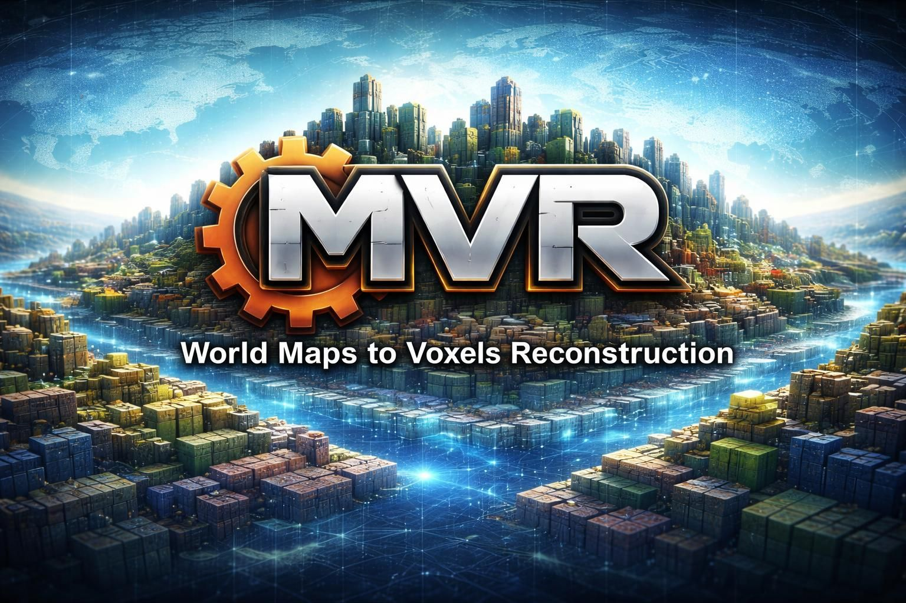
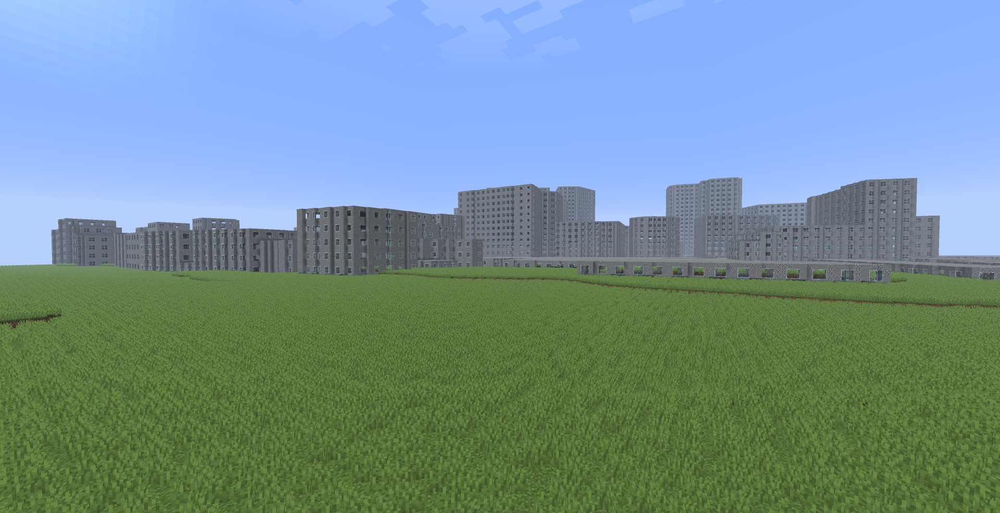

# World Maps to Voxel Reconstruction (MVR)

**Generate real-world terrain and buildings in voxels from geospatial data.**

## Overview

OVR is a Rust-based tool that converts real-world geographic data into voxel worlds. It retrieves elevation data from AWS’s global heightmap tiles and vector map data from OpenStreetMap. The current implementation focuses on generating terrain and building outlines, but the architecture is designed to be extensible – new data providers, element types (roads, rivers, etc.) and output backends (other game engines) can be added.

The generated world consists of a set of Minecraft Java Edition region files, ready to be placed into a `saves` folder.

## Features
- **Super modular architecture** – elevation providers, map element providers, and world backends are all swappable via traits and declarative macros.
- **Really fast** - super modular architecture dont mean that it will run slowly: we dont have dynamic dispatch, and trying optimize code as much as possible for faster generations, without losing code readability. We also have tokio & rayon backed in (parrallel computing).
- **Real‑world elevation** - downloads and interpolates AWS Terrarium DEM tiles at up to 30 m resolution.
- **Map import** – fetches building footprints via the Overpass API.
- **Rich material palette** – maps hundreds of OSM surface materials to voxels with configurable choices (fixed, uniform, or weighted random).
